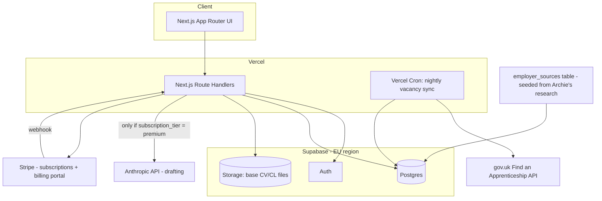

# Apprentio — Build Plan

**Status:** Planning complete, build not started. **Owner:** Archie. **This doc:** source of truth for the product; `CLAUDE.md` in this folder is the quick-reference for whoever (human or Claude) is writing code here.

Decisions below were confirmed by Archie on 2026-08-05 (see § Decisions Log). Anything still open is in § Open Questions — don't build past one without asking.

---

## 1. Vision

A web app where a sixth-form student:

1. Builds a profile once (subjects, grades/predicted grades, sector interest, commute radius, right-to-work status).
2. Sees degree apprenticeship vacancies matched to that profile, pulled from official listings plus a hand-verified employer list.
3. Gets a tailored CV and cover letter drafted per vacancy from their own base documents.
4. Reviews and explicitly approves before anything is treated as "ready to submit" — the app never submits on its own.
5. Tracks every application's status (saved → drafting → ready → approved → submitted → interview → offer/rejected) in one board, with deadline reminders.

Available as a responsive web app — one codebase, works on phone/tablet/laptop. No native app.

## 2. Users

- **MVP:** Archie only, dogfooding his own real applications (GCHQ, Civil Service, KPMG, PwC, EY, etc. — see `seed-data/employer-sources-seed.md` for the existing 16–20 employer research, copied in from the agenticos vault).
- **V1 onward:** other sixth-form students, self-registering. Most users are 16–18 (minors under UK law, but above the 13-year UK GDPR digital-consent age, so self-consent is legally fine — see § Data Protection).
- Not in scope: careers advisors/teachers as a separate role, university (non-apprenticeship) applications, non-UK apprenticeships.

## 3. Decisions Log (confirmed 2026-08-05)

| Decision | Choice | Why |
|---|---|---|
| Automation level | Draft & prepare, human approves every submit | No unattended submission to employer portals — avoids ToS breaches and irreversible bad submissions |
| Audience | Multi-user product, not just Archie | Stated goal is "an app for sixth-form students," not a personal tool |
| Vacancy data | Find an Apprenticeship API (gov.uk) **+** curated employer list, merged | API gives breadth/freshness; curated list catches employers (banks, GCHQ) that don't always post there |
| Hosting | Cloud (Vercel + managed Postgres) | Reachable from all devices with no homelab dependency; standard free/low tier for this scale |
| Monetisation | Freemium — free tier = tracking only, paid tier = AI drafting unlocked | Confirmed 2026-08-05 (see § Subscription model). Caps Anthropic API cost exposure to paying users only |

## 4. Architecture



- **Next.js (App Router) on Vercel** — UI + server-side route handlers, TypeScript throughout, bun for install/scripts/build.
- **Supabase (EU region)** — Postgres with Row Level Security scoping every user-owned table by `user_id`; Auth for signup/login; Storage for uploaded base CVs/cover letters.
- **Anthropic API** — called server-side only (never from the client), with the product's own key, for CV/cover-letter tailoring. Gated to `premium` subscribers only (see § Subscription model) — this is what caps cost exposure, not just a per-user rate limit.
- **Stripe** — subscription billing (checkout, customer portal, webhooks that flip `profiles.subscription_tier`).
- **Vercel Cron** — nightly job pulls the Find an Apprenticeship API and upserts into `vacancies`; a separate seed/admin flow maintains `employer_sources` from curated research.

## 5. Data model

```
profiles (extends Supabase auth.users, 1:1)
  user_id, full_name, school_year, subjects[], grades jsonb, predicted_grades jsonb,
  sectors_of_interest text[], max_commute_minutes int, postcode,
  right_to_work bool, security_clearance_eligible bool,
  base_cv_storage_path, base_cover_letter_storage_path, onboarding_complete bool,
  subscription_tier enum(free|premium) default 'free'

subscriptions  -- billing state, one active row per user
  id, user_id, stripe_customer_id, stripe_subscription_id,
  status enum(active|past_due|canceled|trialing), current_period_end,
  updated_at

vacancies
  id, source enum(gov_api|curated), external_id, employer_name, role_title,
  apprenticeship_level int, sector text[], standard_reference (e.g. ST0409),
  location, postcode, closing_date, apply_url, description, raw_json,
  last_synced_at

employer_sources  -- curated reference data, admin-maintained
  employer_name, portal_url, portal_type enum(direct|ucas|findapprenticeship),
  verified_level, notes, last_verified_at

applications  -- one per (user, vacancy)
  id, user_id, vacancy_id,
  stage enum(saved|drafting|ready_for_review|approved|submitted|interview|offer|rejected|withdrawn),
  drafted_cv, drafted_cover_letter, draft_notes,
  approved_at, submitted_at, submission_method enum(manual|portal_assist),
  notes, deadline_reminder_sent_at

application_events  -- audit trail, mirrors agenticOS's own event-log pattern
  id, application_id, event_type, payload jsonb, created_at
```

RLS: every table except `vacancies` and `employer_sources` (shared reference data, read-only to users) is scoped `user_id = auth.uid()`.

## 6. Core workflows

**Onboarding** — signup → profile builder (subjects, grades, sector interest, commute radius, right-to-work) → upload base CV + cover letter → done.

**Discovery** — matching view filters `vacancies` by profile (sector overlap, level ≥ student's minimum, commute radius via postcode distance, `closing_date >= today`). Student saves ones they want → creates `applications` row at `saved`. **Free and premium both get this in full** — discovery/matching is never gated.

**Drafting** *(premium only)* — student clicks "Draft" on a saved application → server checks `subscription_tier = premium` → calls Claude with base CV/CL + vacancy description + any employer notes → produces tailored CV/CL → stage → `ready_for_review`. Free users see the same button as an upsell ("Upgrade to draft a tailored CV & cover letter for this application") instead of it firing.

**Approval** — student reviews the tailored documents (diff against base) → **Approve** moves to `approved` and surfaces the final content + the direct apply URL; **Edit** lets them adjust before re-approving; **Reject** discards with a reason. Nothing is ever submitted without this step. Applies identically regardless of tier — approval is a safety rule, not a paywall lever.

**Submission (MVP)** — approved application shows ready-to-paste content + the employer's apply link; student submits on the employer's own site/portal themselves and clicks "Mark as submitted" → stage → `submitted`, timestamp logged. Free users can still mark an application `submitted` even without ever using the drafting feature — they just wrote the CV/CL themselves outside the app.

**Tracking** — kanban-style board across all stages; deadline reminders (email) as `closing_date` approaches; manual stage updates for interview/offer/rejected outcomes. Free and premium both get full tracking.

## 7. Subscription model

**Free tier — "basics"**
- Full vacancy discovery/matching against the student's profile.
- Save vacancies, manual application tracking through every stage, deadline reminders.
- 2 free AI-drafted CVs/cover letters as a taster (server-side counted via `profiles.free_drafts_used`, atomically checked so concurrent requests can't bypass the cap — see `TODO.md` Security #1); after that, drafting requires premium. Student manages their own documents outside the app for anything beyond the 2 free drafts.

**Premium tier — "full automation"**
- Everything in free, plus: AI-drafted, per-vacancy tailored CV and cover letter (§ Core workflows → Drafting), still gated behind the same mandatory approval step as everything else.
- Reserved for premium once built: Phase 4's portal-assist autofill (§ Roadmap) — an even deeper form of "automation," so it inherits the same gate.

**Enforcement**
- `profiles.subscription_tier` is the single source of truth the UI and API both check; never trust a client-side flag.
- Stripe Checkout for upgrade, Stripe Customer Portal for self-serve cancel/manage, Stripe webhooks are the only writer of `subscription_tier` and the `subscriptions` table (source of truth flows from Stripe, not from the app guessing at payment state).
- On downgrade/cancellation, only the *Anthropic call itself* (creating a brand-new draft) is gated — editing, approving, rejecting, and marking-submitted on an existing draft all stay fully usable regardless of tier, since they're free local operations and blocking them would strand a lapsed subscriber mid-application. (Implemented and confirmed live 2026-08-05; supersedes this section's earlier "read-only" wording, which was more restrictive than the actual intent.)

## 8. Data protection (minors)

- Sixth-formers are typically 16–18 — above the UK GDPR digital-consent age of 13, so self-registration/consent is legally workable without a parental-consent flow.
- Still required before any real user signs up: a plain-English privacy policy and ToS, EU/UK data residency (Supabase EU region — already decided), data minimisation (don't collect more than matching/drafting needs — e.g. store a grade band, not full transcripts, if a band suffices), and an account-deletion flow that purges profile data and stored documents.
- **Flag, don't draft-and-ship:** an initial privacy policy/ToS can be drafted as a starting point, but treat it as needing an actual human (ideally legal) read before it governs real minors' data — this is called out again in § Open Questions.

## 9. Roadmap

**Phase 0 — Foundations**
Repo scaffold (Next.js + TS + bun), Supabase project (EU region) + schema + RLS, Vercel deploy pipeline, auth wired end-to-end with a single test account.

**Phase 1 — MVP (dogfood, Archie only)**
Profile builder, vacancy sync (API + seeded `employer_sources` from `seed-data/employer-sources-seed.md`), matching view, save/draft/approve/mark-submitted flow, application board. Archie gets premium features unconditionally (no billing exists yet) — success = he runs a real application through the app end to end.

**Phase 2 — Multi-user & subscriptions**
Public signup, onboarding flow, privacy policy + ToS (flagged for human review before going live), Stripe Checkout + Customer Portal + webhooks, `subscription_tier` gating on the drafting feature (§ Subscription model), admin view for maintaining `employer_sources`.

**Phase 3 — Reminders & polish**
Deadline email reminders, weekly digest, ICS calendar export, mobile layout pass.

**Phase 4 — Stretch: portal assist**
For a small set of employers we've explicitly mapped, an assisted autofill (e.g. Playwright) that pre-fills the employer's own application form — the human still clicks the final submit on the employer's site. Opt-in per employer, not a default, because portal structures vary and some ToS may prohibit automated form-filling even with a human in the loop. Premium-only, same as drafting.

## 10. Risks

- **Vacancy data coverage** — the gov.uk API won't include every employer (e.g. GCHQ often posts directly); the curated list mitigates this but needs periodic manual re-verification, same as Archie's existing research doc already flags (NCC Group, Marsh McLennan pending verification).
- **AI drafting cost at scale** — mitigated structurally by gating drafting to paying users, but still needs a soft per-user cap (e.g. drafts/month) so one subscriber can't run costs unbounded — see § Open Questions for the actual cap number.
- **Portal diversity** — every employer's application process differs (direct form, UCAS, findapprenticeship.service.gov.uk); the MVP sidesteps this by never automating the actual portal, only preparing content.

## 11. Open questions (ask before building past these)

- **Pricing** — price point, monthly vs. annual, free trial of premium or not. Not needed for MVP (Archie has unconditional access pre-billing), matters before Phase 2 wires up Stripe.
- **Premium usage cap** — unlimited drafts for subscribers, or a soft monthly cap with overage/upsell? Affects cost predictability.
- **Privacy policy/ToS review** — who reviews the drafted policy before real minors' data (and payment data) is collected in Phase 2? (parent, teacher, or a proper legal read)
- **Sector scope for MVP profile** — Archie's own use case is cyber-only; confirm the matching UI should still expose all sectors from day one (as scoped) rather than shipping cyber-only and generalising later.
- **Email provider** for Phase 3 reminders — no preference stated yet.

---

*Seed data source for `employer_sources`: `seed-data/employer-sources-seed.md` (16–20 verified L6 employers, 3-wave application strategy, already researched by the Careers agent — copied from the agenticos vault at `40-projects/apprenticeships/FILTERED-EMPLOYER-LIST.md`).*
